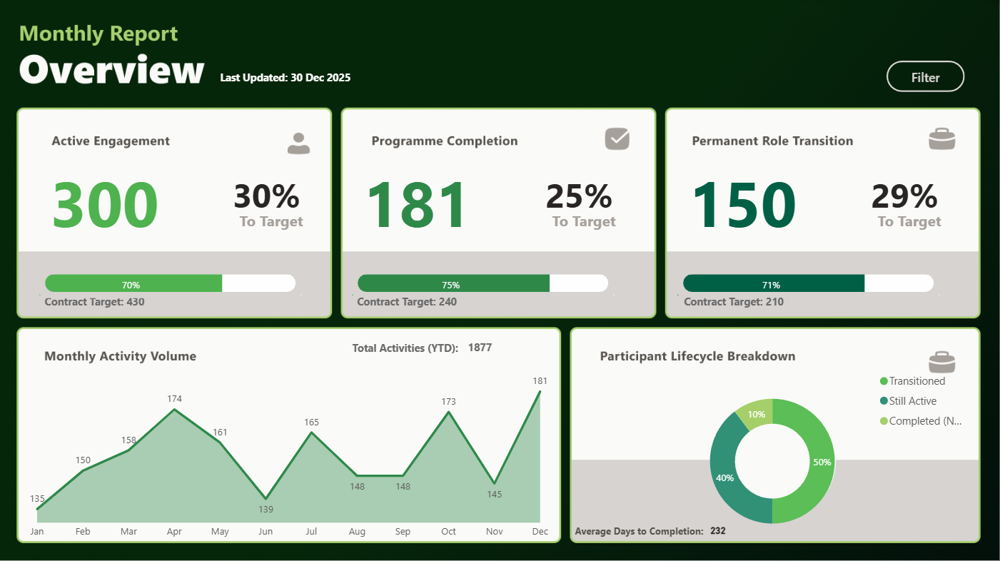
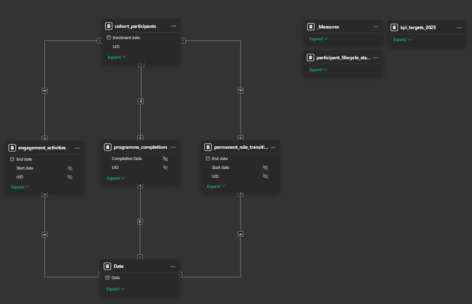

# Programme Performance Dashboard


---

## Overview

This project reflects a structured Power BI dashboard built to monitor programme performance against defined annual targets.

In performance reporting, the focus is on communicating programme performance clearly to stakeholders. Measures must respond consistently to time filters, participant segments, and outcomes so results remain accurate and easy to interpret. Without a structured model underneath, KPIs can behave unpredictably and weaken confidence in the numbers.

The dashboard layout was first structured in Figma to define visual hierarchy, KPI emphasis, and user flow before implementation in Power BI.

Rather than building visuals directly from raw tables, this report was designed using a clear model structure that:

- Separates participant, date, and outcome tables  
- Ensures filters behave consistently across visuals  
- Calculates KPI progress against defined targets  
- Prevents blank values from breaking performance indicators  

The goal was to build a reliable and reusable performance monitoring model where KPI logic remains consistent and reporting is easy to maintain over time.

---

## Dashboard Preview

### Overview Page



### Model View



---

## The Problem

Performance reporting becomes difficult when programme data exists in spreadsheets or disconnected extracts without a structured way to present it. Stakeholders may receive raw totals, but without consistent measures and visual hierarchy, it is hard to interpret trends, understand progress against targets, or identify where attention is needed.

When KPI logic is inconsistent or filtering behaves unpredictably, confidence in the numbers drops. This makes it harder to translate operational data into clear, actionable insights.

This project demonstrates how structured modelling and intentional design can turn programme data into meaningful performance reporting that stakeholders can interpret and act on.

---

## What This Dashboard Does

This dashboard:

- Tracks participant engagement volumes  
- Tracks programme completions  
- Tracks permanent role transitions  
- Calculates percentage achieved against annual targets  
- Displays remaining progress visually  
- Provides monthly trend analysis  
- Allows filtering by:
  - Month  
  - Gender  
  - Employment Type  

All KPIs update dynamically based on selected filters.

---

## Model Structure

The data model separates:

- **cohort_participants** (participant dimension)  
- **Date** (time dimension)  
- **engagement_activities** (fact table)  
- **programme_completions** (fact table)  
- **permanent_role_transitions** (fact table)  
- **kpi_targets_2025** (target reference table)  
- **_Measures** (centralised measure table)  

A dedicated Date table connects to all event date fields, ensuring consistent month filtering across engagement, completions, and transitions.

Relationships are configured as single-direction 1:* to maintain predictable filter behaviour.

---

## Key Measures

### Active Engagement (In Period)

```DAX
Active Engagement (In Period) =
COALESCE(
    DISTINCTCOUNT(engagement_activities[UID]),
    0
)
```

This measure counts the number of unique participants who have engagement activity in the selected period.

DISTINCTCOUNT ensures that each participant is only counted once, even if multiple activity records exist in the same month.  
COALESCE replaces blank results with 0 so the KPI remains stable when no records exist for a selected filter.

---

### Permanent Role Transitions

```DAX
Permanent Role Transitions =
COALESCE(
    DISTINCTCOUNT(permanent_role_transitions[UID]),
    0
)
```

This measure counts the number of unique participants who transitioned into permanent roles during the selected period.

DISTINCTCOUNT prevents duplicate counting when a participant has multiple related records, and COALESCE ensures the result returns 0 instead of blank when no transitions occur.

---

### Percentage to Target

```DAX
Active Engagement % To Target =
DIVIDE(
    [Active Engagement (In Period)],
    430,
    0
)
```

This measure calculates progress toward the annual engagement target.

DIVIDE safely handles division and returns 0 if the denominator is zero or no data exists. This prevents errors or blanks from appearing in visuals.

Together, these functions ensure that performance measures are accurate, stable under filtering, and safe from unexpected behaviour.

---

## Interactive Filtering

The report includes slicers for:

- **Month (YearMonth)**  
- **Gender**  
- **Employment Type**  

Filtering is controlled through the dimensional model:

- Date filters affect all outcome tables  
- Participant filters cascade to related activity and outcome tables  
- Employment type filters apply to transition outcomes  

This ensures consistent and predictable behaviour across visuals.

---

## Project Structure

```
├── README.md
├── programme-performance-dashboard.pbix
└── screenshots
    ├── Overview.png
    └── model-view.png
```

---

## Impact on Performance Reporting

This dashboard demonstrates how structured modelling and intentional visual design can turn raw data into clear, usable performance insight.

It:

- Supports informed decision-making by presenting performance clearly and consistently  
- Ensures KPIs update reliably under filtering  
- Stores target values separately so they can be updated without rewriting measures  
- Provides a structured view of progress over time  

By introducing structure into the model and clarity into the design, complex operational data becomes easier to interpret and act on.
